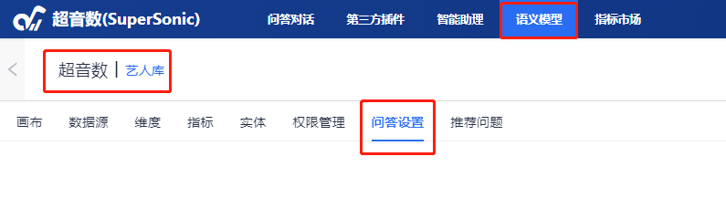
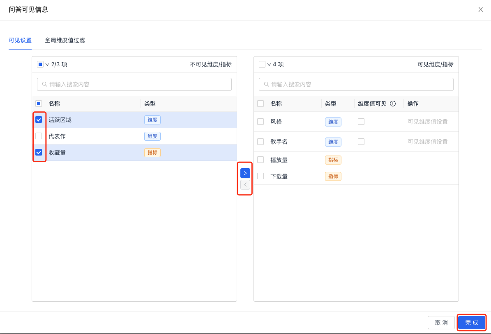
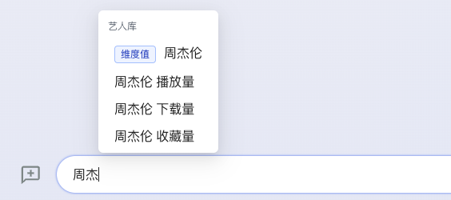
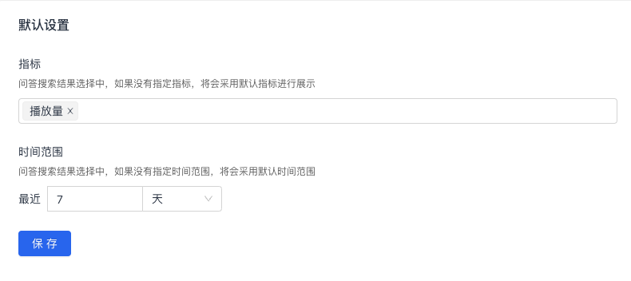
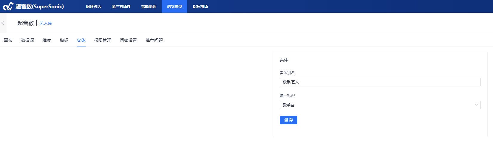
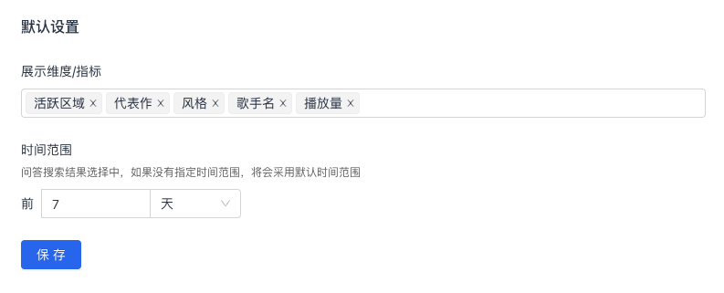

English | [中文](chat_config_cn.md)
# 问答设置

问答设置旨在进一步降低用户通过自然语言方式获取数据的门槛。在超音数平台首页, 单击顶部菜单栏的**问答设置**, 然后选择特定的**主题域**, 便可对特定主题域进行问答设置, 当前支持对指标场景和明细场景分别进行设置。

## 1. 指标场景

指标场景指基于特定的维度, 进行指标的分析, 这会涉及到 group by 的聚合计算, 比如"按活跃区域查询播放量", 会基于维度**活跃区域**, 查看指标**播放量**在不同活跃区域的聚合数据。

### 1.1 问答可见

* 如果希望在指标场景中设置特定维度/指标的可见性, 通过以下3步即可实现：

1. 在左侧列表中选择需要可见的维度和指标;
2. 点击中间的 **>** 标志, 可将其状态由不可见转变为可见;
3. 点击底部**完成**按钮。

* 如果还希望实现**维度值的联想**, 通过以下步骤即可实现:

1. 对特定的维度, 勾选**维度值可见**选项;
2. 如果有高级设置的需要, 可点击**可见维度值设置**[可选的], 高级设置可对该维度的维度值设置黑名单、白名单、sql规则等 ;
3. 点击底部**完成**按钮。

设置后, 系统会启动后台任务, 计算对应维度的维度值, 并写入到问答知识库中, 当用户输入不完整的歌手名时, 系统会根据知识库中的数据进行维度值联想。

### 1.2 默认设置

指标场景的默认设置分为指标和时间范围两个选项：

- **指标:**  在指标场景时, 如果用户查询中没有指定指标, 系统会用此处设置的指标进行查询;
- **时间范围:**  在指标场景时, 如果用户查询中没有指定时间范围, 如"查询流行歌手的播放量", 系统会用此处设置的时间选项进行查询, 最终查询为"查询流行歌手的最近7天的播放量"。

## 2. 明细场景

指标场景指仅仅查询原始明细数据, 不会涉及到聚合计算, 比如"周杰伦的代表作"。

### 2.1 实体

实体是指数据表中的唯一标识, 类似于主键。 一般而言，一个主题域中只有一个实体。如维度歌手名可以作为艺人库实体的唯一标识。

实体只在明细场景中存在，指标场景不存在实体。当系统识别出当前查询是针对实体展开的，那么就可确定当前是一个明细查询的场景。实体设置主要分为实体别名和唯一标识两部分：

- **实体别名:** 可用别名来简化实体查询, 使查询更简单;
- **唯一标识:** 一个实体的唯一标识, 一般是维度。

### 2.2 问答可见

具体配置含义可参考 *1.1 指标场景问答可见*

### 2.3 默认设置

- **维度/指标:** 在明细场景时, 如果用户查询中没有指定维度/指标, 系统会用此处设置的维度/指标进行查询, 如输入"周杰伦", 系统会将周杰伦作为维度歌手名的筛选条件, 然后查询出设置的维度/指标数据;
- **时间范围:** 用户可根据数据特定的时效性, 设置时间点, 如果用户明细查询中不涉及时间信息, 则会用此处配置的时间进行查询。

